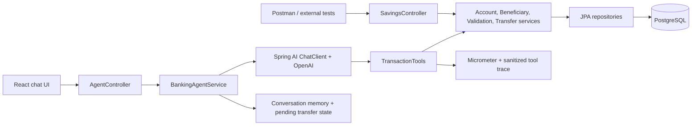

# Architecture

The agent gets the four Spring AI tools and decides which to call. Controllers do not run a fixed transfer workflow. Sensitive operations are guarded again inside the tool-backed services.
